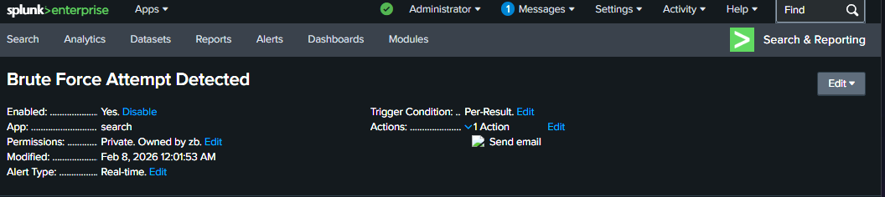

# 🛡️ Linux SOC Monitoring & Real-Time Alerting System
This project demonstrates a professional-grade Security Operations Center (SOC) setup using **Splunk Enterprise** to monitor a distributed Linux ecosystem (RHEL 10 and Zorin OS).

## 📊 Project Highlights
* **Advanced SOC Dashboard:** Created a high-level intelligence dashboard for real-time ingestion tracking and security auditing.
* **Brute Force Detection:** Configured real-time alerts to detect multiple failed login attempts within a short window.
* **Service Health Monitoring:** Tracked system service failures (e.g., watchdog service) across multiple Linux endpoints.

## 🛠️ Skills & Tools Demonstrated
* **SIEM:** Splunk Enterprise (Searching, Alerting, Dashboarding).
* **Linux Security:** Log analysis of `/var/log/secure` and `/var/log/messages`.
* **Endpoint Monitoring:** Configuring Splunk Universal Forwarders on RHEL and Zorin OS.

## 📸 Key Visuals
### 1. Unified Security Dashboard
A single pane of glass view showing Infrastructure Heartbeat, Ingestion Trends, and Security Audits.

### 2. Real-Time Alerting (Brute Force Attack)
Successfully triggered **Critical Severity Alerts** when multiple failed passwords were detected on the `redhat-zb` host.

### 3. Deep-Dive Investigation
Analyzing raw events to identify specific service failures and unauthorized access attempts.

## 🚀 How it Works
1. Logs are forwarded from Linux endpoints via **Universal Forwarders**.
2. **Splunk Indexer** processes and categorizes the data.
3. Custom **SPL (Search Processing Language)** queries filter for security incidents.
4. **Alert Actions** are triggered to notify the SOC team for immediate response.

   
## 📸 Project Evidence

### 1️⃣ Security Dashboard Overview

### 2️⃣ Brute Force Detection Alert

### 3️⃣ Real-Time Alert Triggered

### 4️⃣ Deep-Dive Log Analysis

