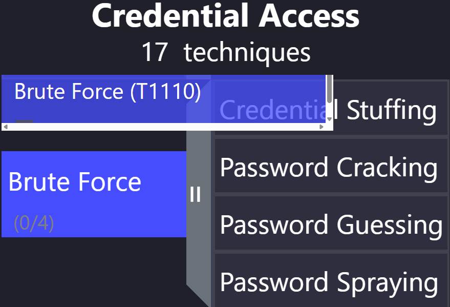

# SOC SSH Brute Force Detection Lab

## 📌 Project Overview
This lab demonstrates detection of SSH brute force attacks using Splunk SIEM.  
Attack simulation was performed using Hydra and logs were analyzed in Splunk.

---

## 🧩 Lab Architecture
The lab environment consists of:

- Attacker Machine: Kali Linux

- Target Machines: RHEL 10 / Zorin OS

- SIEM Platform: Splunk Enterprise

- Log Source: /var/log/secure (SSH authentication logs)

- Detection Method: Custom SPL queries monitoring failed SSH login attempts
  

---

## ⚔️ Attack Simulation
SSH brute force attacks were simulated using Hydra to generate multiple failed authentication attempts against Linux target systems.

---

## 🕒 Attack Timeline

SSH brute force simulations were executed from a Kali Linux attacker machine on 12 February 2026.

#### Attack Session 1
- **Start Time:** 2026-02-12 23:24:00
- **Target Host:** 10.236.163.180
- **Target Username:** sadia
- **Tool Used:** Hydra v9.6
- **Wordlist:** rockyou.txt
- **Protocol:** SSH (Port 22)
- **Total Failed Attempts:** 1801

#### Attack Session 2
- **Start Time:** 2026-02-12 23:28:37
- **Target Host:** 10.236.163.53
- **Target Username:** redhat-zb
- **Tool Used:** Hydra v9.6
- **Wordlist:** rockyou.txt
- **Protocol:** SSH (Port 22)
- - **Total Failed Attempts:** 294

Both sessions generated high-volume failed authentication attempts, which were successfully detected and logged in Splunk.

No successful login was observed during the attack simulation.

---

## 🗂 MITRE ATT&CK Mapping

This lab maps the SSH brute force simulation to the MITRE ATT&CK framework:

- **Technique ID:** T1110  
- **Technique Name:** Brute Force  
- **Description:** Attempts to gain access by systematically guessing passwords on SSH accounts.
  
- **Observed Behavior in Lab:**
  - Multiple failed login attempts from single source IPs
  - Attempts against high-privileged accounts (root, admin)
  - Logins outside normal hours
    
- **Detection Method:**
  - Splunk SPL queries monitored `/var/log/secure` for failed authentication attempts
  - Alerts configured for multiple failed logins per IP
  - Top attacking IPs visualized on dashboards

    ### MITRE ATT&CK Visualization

  ---

## 🔍 Detection Logic

### Time-Based Brute Force Detection

This query detects high-frequency failed SSH login attempts by aggregating events per source IP within a 1-minute window.  
IPs generating more than 5 failed attempts per minute are flagged as potential brute force sources.  
The detection logic supports real-time alerting and rapid identification of suspicious authentication activity.

- index=* "Failed password"| rex "from (?<attacker_ip>(\d{1,3}\.){3}\d{1,3}|[a-fA-F0-9:]+)" | bucket _time span=1m | stats count by _time, attacker_ip | where count > 5 | sort -count
  
This logic supports real-time alerting and rapid identification of suspicious authentication behavior.
  

---

## 🚨 Alert Triggered
A real-time Splunk alert was configured to trigger when brute force thresholds were exceeded.

Alert actions included:

- Security notification
- Event correlation visibility
- Dashboard update for investigation

---

## 🕵️ Investigation Workflow
The investigation process included:
- Identifying the attacking source IP
- Reviewing failed authentication counts
- Correlating timestamps with attack timeline
- Verifying absence of successful compromise
- Assessing targeted accounts

Collected logs provided clear evidence supporting incident analysis and response validation.

---

## 🛡 Mitigation Recommendations  

To reduce the risk of SSH brute-force attacks and strengthen system security, the following measures were implemented:

- Enforced SSH key-based authentication by disabling password authentication.
- Deployed Fail2Ban to automatically block IP addresses after repeated failed login attempts.
- Applied firewall rules to restrict SSH access to trusted IP ranges only.
- Enabled continuous monitoring and real-time alerting through Splunk SIEM.
  
---

## 🛠 Tools Used
- Splunk Enterprise
- Kali Linux
- Zorin OS & RHEL 10
- Hydra

---

## 🎯 Skills Demonstrated
- SIEM Monitoring & Alert Engineering
- Log Analysis & Event Correlation
- Brute Force Detection Engineering
- MITRE ATT&CK Mapping
- Incident Investigation Workflow
- Defensive Hardening & Mitigation Strategy
